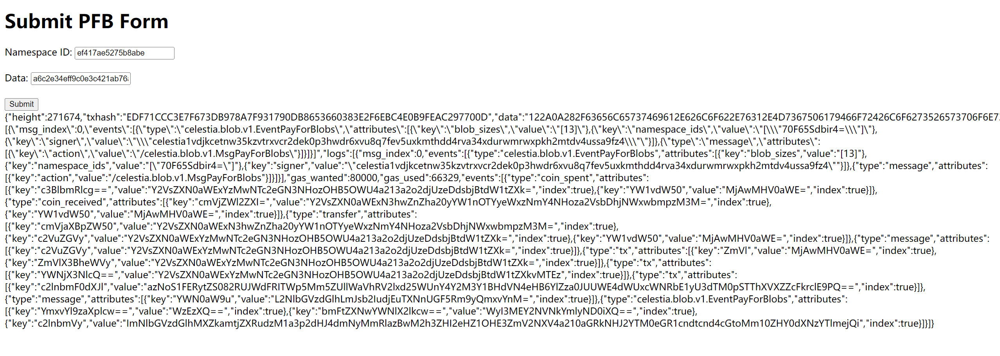

# This is a Pay For Blob demo

## I run the code in [http://193.46.243.16:4001/](http://193.46.243.16:4001/



Follow this tutorial to run my code in your server:

```jsx
git clone https://github.com/wcz1997/PFB

sudo apt-get update

sudo apt-get install nodejs

sudo apt-get install npm

npm install express

npm install multer

npm install axios
```

```jsx
cd PFB
```

```jsx
node index.js
```

## I run the code in [http://193.46.243.16:4001/](http://193.46.243.16:4001/)


Follow this tutorial to run my code in your server:

```jsx
git clone https://github.com/wcz1997/PFB

sudo apt-get update

sudo apt-get install nodejs

sudo apt-get install npm

npm install express

npm install multer

npm install axios
```

```jsx
cd PFB
```

```jsx
node index.js
```
